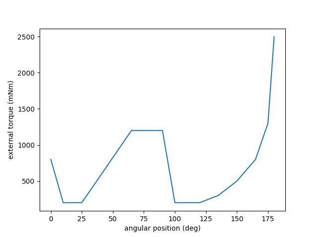
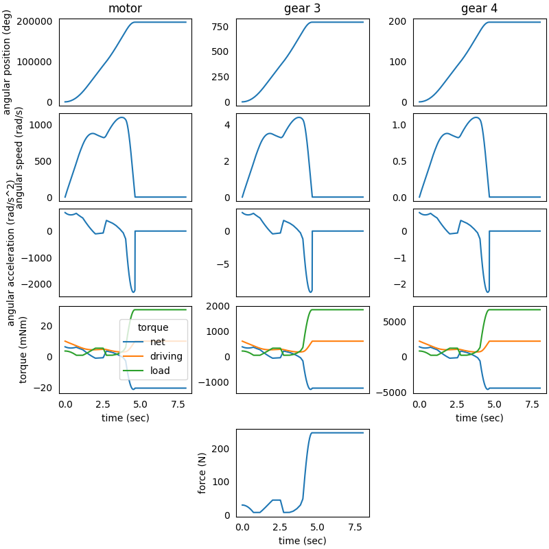

### System in Analysis

The complete example code is available 
[here](https://github.com/AndreaBlengino/gearpy/blob/master/docs/source/examples/11_external_torque_from_file/external_torque_from_file.py).  
The mechanical powertrain to be studied is the one described in the 
[7 - Worm and Helical Gears](https://gearpy.readthedocs.io/en/latest/examples/7_worm_and_helical_gears/index.html) 
example.  
We want to apply an external load torque picked from a file.

### External Load Torque Analysis

The external load torque data are stored in a file named `'external_torque_data.csv`'
in the `'data'` folder; we have to open this file: 

```python
import os
import pandas as pd

ext_torque_data = pd.read_csv(os.path.join('data', 'external_torque_data.csv'))

print(ext_torque_data)
```

```text
     angular position (deg)  external torque (mNm)
0                       0.0                  800.0
1                       1.0                  740.0
2                       2.0                  680.0
3                       3.0                  620.0
4                       4.0                  560.0
..                      ...                    ...
176                   176.0                 1540.0
177                   177.0                 1780.0
178                   178.0                 2020.0
179                   179.0                 2260.0
180                   180.0                 2500.0
```

We can see that the file contains two columns: one for the angular 
position of the last gear, in deg, and the other one for the applied 
external torque, in mNm. The file contains 181 rows, one for each 
degree from 0 deg up to 180 deg.  
We can plot this data in oder to have a better understanding of the
applied external torque:

```python
import matplotlib.pyplot as plt

fig, ax = plt.subplots()

ax.plot(ext_torque_data['angular position (deg)'], ext_torque_data['external torque (mNm)'])

ax.set_xlabel('angular position (deg)')
ax.set_ylabel('external torque (mNm)')

plt.show()
```



The external load starts from 800 mNm and decreases up to a base level
at 200 mNm. Then, it gradually increases up to 1200 mNm, where stays
constant up to 90 deg, after which it quickly decreases to the base level.
Finally, it increases faster and faster as the angular position approaches
to 180 deg.

### Model Set Up

We have to use an interpolation function to model the external load torque:

```python
from scipy.interpolate import interp1d

ext_torque_func = interp1d(x = ext_torque_data['angular position (deg)'],
                           y = ext_torque_data['external torque (mNm)'],
                           fill_value = 'extrapolate')
```

This interpolation function accept values in deg and returns values in mNm.  
Moreover, this interpolation function can accept values outside the 
0 deg - 180 deg interval provided by data, so we can compute the external 
load torque even if the last gear angular position is outside this range.  
Now we can set the external load:

```python
def ext_torque(time, angular_position, angular_speed):
    return Torque(value = ext_torque_func(angular_position.to('deg').value).take(0),
                  unit = 'mNm')

gear_4.external_torque = ext_torque
```

In order to grasp the external torque pattern, we use a fine time discretization
in the solver:

```python
solver = Solver(powertrain = powertrain)
solver.run(time_discretization = TimeInterval(0.01, 'sec'),
           simulation_time = TimeInterval(8, 'sec'))
```

The remaining set-ups of the model stay the same.

### Results Analysis

We can get a snapshot of the system at a particular time of interest:

```python
powertrain.snapshot(target_time = Time(8, 'sec'),
                    angular_position_unit = 'deg',
                    torque_unit = 'mNm',
                    driving_torque_unit = 'mNm',
                    load_torque_unit = 'mNm')
```

```text
Mechanical Powertrain Status at Time = 8 sec
            angular position (deg)  angular speed (rad/s)  angular acceleration (rad/s^2)  torque (mNm)  driving torque (mNm)  load torque (mNm) tangential force (N)  pwm
motor                197248.535916                    0.0                             0.0    -20.256702             10.000000          30.256702                       1.0
flywheel             197248.535916                    0.0                             0.0    -20.256702             10.000000          30.256702                          
worm gear            197248.535916                    0.0                             0.0    -20.256702             10.000000          30.256702                          
worm wheel             3944.970718                    0.0                             0.0   -274.395658            135.459195         409.854853                          
gear 1                 3944.970718                    0.0                             0.0   -274.395658            135.459195         409.854853                          
gear 2                  788.994144                    0.0                             0.0  -1234.780461            609.566378        1844.346839                          
gear 3                  788.994144                    0.0                             0.0  -1234.780461            609.566378        1844.346839           245.912912     
gear 4                  197.248536                    0.0                             0.0  -4445.209659           2194.438961        6639.648620                          
```

We can get a more general view of the system by plotting the time 
variables and focus the plot only on interesting elements and variables. 
We can also specify a more convenient unit to use when plotting torques:

```python
powertrain.plot(figsize = (8, 8),
                elements = ['motor', 'gear 3', 'gear 4'],
                angular_position_unit = 'deg',
                torque_unit = 'mNm',
                variables = ['angular position', 'angular speed', 'angular acceleration', 'driving torque',
                             'load torque', 'torque', 'tangential force'])
```



We can see that the tangential force on the *gear 3* follows the same 
pattern of the applied external torque. There is only a slight difference 
at the beginning, when the angular position of the system is not linear 
with respect to the time, and at the end, when the external load torque is 
so high that the motor cannot push forward anymore.  
The load torque of each powertrain's element follow the same pattern.  
We can see from the snapshot and from the plot that the *gear 4*'s angular 
position is more than 197 deg. Even if this angular position is outside 
the 0 deg - 180 deg provided by the data in the file, the defined interpolation 
function `ext_torque_func` is still able to compute the external load torque, 
which is more than 6600 mNm.
