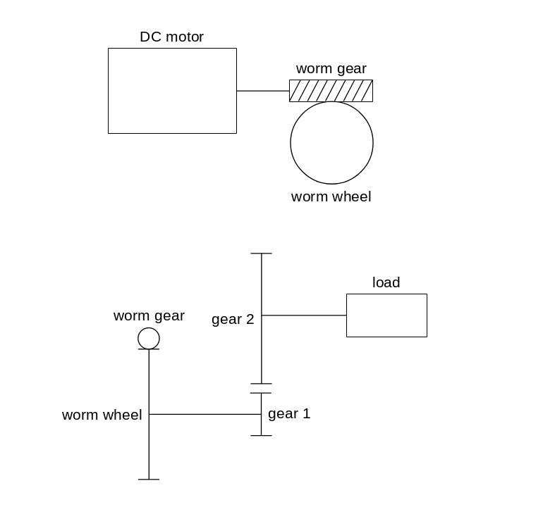
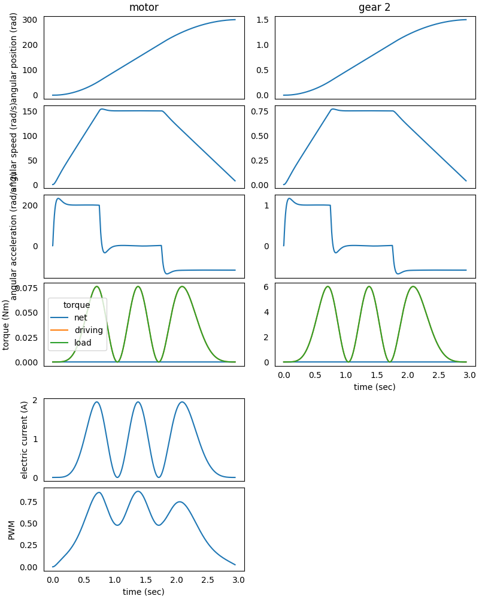
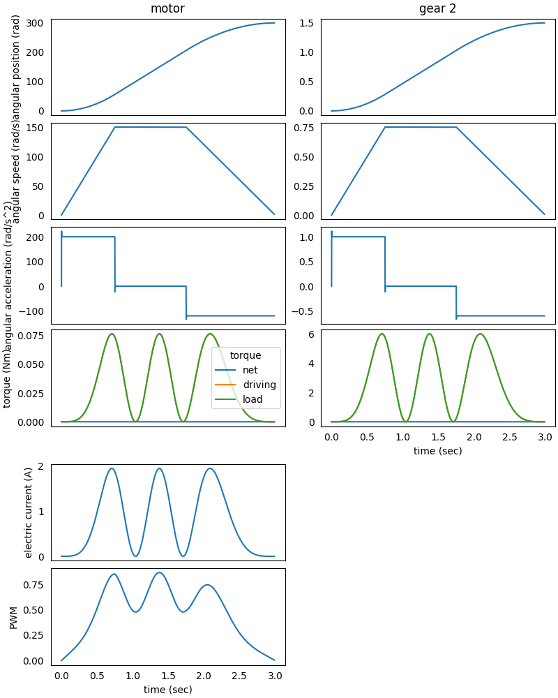
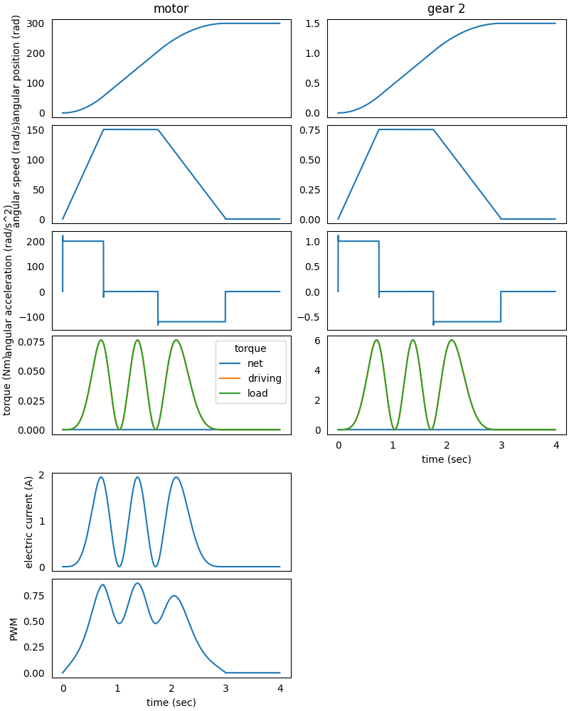
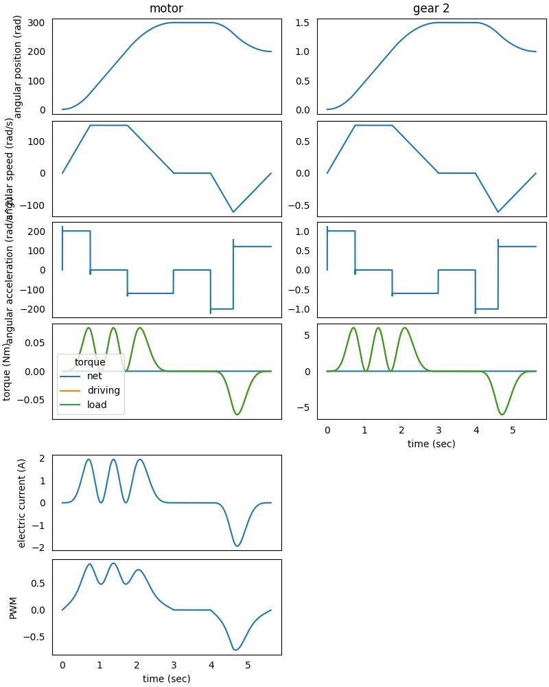

### System in Analysis

The complete example code is available [here](https://github.com/AndreaBlengino/gearpy/blob/master/docs/source/examples/12_s_curve_trajectory/s_curve_trajectory.py).  
The mechanical powertrain to be studied is reported in the image below:



The *worm gear* is connected to the *DC motor* output shaft and rotates with 
it. The *worm gear* mates with the *worm wheel*, which is connected to *gear 1* 
through a rigid shaft, so the *worm wheel* and the *gear 1* rotate together. 
Finally, the *gear 2* mates with *gear 1* and carries the external load.   
The analysis is focused on final *gear 2* position and velocity control with
respect to an S-curve trajectory from a starting to a stopping positions.


### Model Set Up

As a first step, we instantiate the components of the mechanical 
powertrain:

```python
from gearpy.mechanical_objects import DCMotor, WormGear, WormWheel, SpurGear
from gearpy.units import (
    AngularSpeed,
    InertiaMoment,
    Torque,
    Current,
    Angle,
)

motor = DCMotor(
    name='motor',
    no_load_speed=AngularSpeed(value=3000, unit='rpm'),
    maximum_torque=Torque(value=2000, unit='gfcm'),
    inertia_moment=InertiaMoment(value=50, unit='gcm^2'),
    no_load_electric_current=Current(value=0, unit='mA'),
    maximum_electric_current=Current(value=5, unit='A')
)
worm_gear = WormGear(
    name='worm gear',
    n_starts=1,
    inertia_moment=InertiaMoment(value=1, unit='gcm^2'),
    pressure_angle=Angle(value=20, unit='deg'),
    helix_angle=Angle(value=10, unit='deg')
)
worm_wheel = WormWheel(
    name='worm wheel',
    n_teeth=50,
    inertia_moment=InertiaMoment(value=40, unit='gcm^2'),
    pressure_angle=Angle(value=20, unit='deg'),
    helix_angle=Angle(value=10, unit='deg')
)
gear_1 = SpurGear(
    name='gear 1',
    n_teeth=10,
    inertia_moment=InertiaMoment(value=2, unit='gcm^2')
)
gear_2 = SpurGear(
    name='gear 2',
    n_teeth=40,
    inertia_moment=InertiaMoment(value=100, unit='gcm^2')
)
```

Then it is necessary to specify the connection types between the 
components. We choose to study a non-ideal powertrain so, in order to 
take into account power loss in mating due to friction, we specify a 
gear mating efficiency below $100\%$ and a friction coefficient in the 
worm gear mating:

```python
from gearpy.utils import add_fixed_joint, add_gear_mating, add_worm_gear_mating

add_fixed_joint(master=motor, slave=worm_gear)
add_worm_gear_mating(
    master=worm_gear,
    slave=worm_wheel,
    friction_coefficient=0.2
)
add_fixed_joint(master=worm_wheel, slave=gear_1)
add_gear_mating(master=gear_1, slave=gear_2, efficiency=0.9)
```

We have to define the external load applied to *gear 2*. The load torque is 
periodic with respect to the final gear angular position:

```python
def ext_torque(time, angular_position, angular_speed):
    return Torque(
        value=3*(1-angular_position.cos(frequency=2)),
        unit='Nm'
    )

gear_2.external_torque = ext_torque
 ```

Then we have to define the S-curve trajectory characteristics and the control 
logic to apply to the motor, in order to make the *gear 2* follow a specific 
trajectory.  
The *gear 2* starts from $0\ rad$ and stops to $1.5\ rad$ for few seconds, then 
goes back to $1\ rad$ as final position; these values are going to be multiplied 
by the total reduction ratio to get the respective *motor* positions.  
To properly reproduce the three motion phases, we can split each of them in 
three analysis:
- a forward motion of the *gear 2* from $0\ rad$ to $1.5\ rad$
- a pause at $1.5\ rad$
- a backward motion of the *gear 2* from $1.5\ rad$ to $1\ rad$

We can define these reference positions:

```python
from grerpy.units import AngularPosition

start_position = AngularPosition(value=0, unit='rad')
intermediate_position = AngularPosition(value=1.5, unit='rad')
final_position = AngularPosition(value=1, unit='rad')
```

With respective to the *motor*, the forward and backward motions are determined 
by the S-curve, which has 3 parts: 
- an acceleration part at $200\ rad/s^2$
- a steady velocity part at $150\ rad/s$
- a deceleration part at $120\ rad/s^2$

We can proceed to define the trajectory of the *motor* in the first phase:

```python
from gearpy.units import AngularAcceleration
from gearpy.motor_control.utils import SCurveTrajectory

total_reduction_ratio = gear_2.n_teeth/gear_1.n_teeth*worm_wheel.n_teeth

start_speed = AngularSpeed(value=0, unit='rad/s')


trajectory = SCurveTrajectory(
    start_position=total_reduction_ratio*start_position,
    stop_position=total_reduction_ratio*intermediate_position,
    maximum_velocity=AngularSpeed(value=150, unit='rad/s'),
    maximum_acceleration=AngularAcceleration(value=200, unit='rad/s^2'),
    maximum_deceleration=AngularAcceleration(value=120, unit='rad/s^2'),
    start_velocity=total_reduction_ratio*start_speed,
)
```

See {py:class}`SCurveTrajectory <gearpy.motor_control.utils.s_curve_trajectory.SCurveTrajectory>` 
for more details on the S-curve trajectory.  
Then we can define the control tool the make the motor follow the trajectory: a 
position and velocity control made by two nested PID controllers. The position
PID generates a velocity reference used by the velocity PID to compute a PWM 
reference:

```python
from gearpy.motor_control.utils import PIDController

position_PID = PIDController(Kp=40, Ki=50, Kd=0)
velocity_PID = PIDController(
    Kp=0.002,
    Ki=0.2,
    Kd=0,
    clamping=True,
    reference_min=-1,
    reference_max=1
)
```

See {py:class}`PIDController <gearpy.motor_control.utils.pid_controller.PIDController>` 
for more details on PID controllers.  
Finally, we can combine all components in a powertrain object and define the 
control logic:

```python
from gearpy.powertrain import Powertrain
from gearpy.sensors import AbsoluteRotaryEncoder, Tachometer
from gearpy.motor_control.rules import PositionAndVelocityControl
from gearpy.motor_control import PWMControl

powertrain = Powertrain(motor=motor)

encoder = AbsoluteRotaryEncoder(target=motor)
tachometer = Tachometer(target=motor)

position_control = PositionAndVelocityControl(
    encoder=encoder,
    tachometer=tachometer,
    powertrain=powertrain,
    position_PID=position_PID,
    velocity_PID=velocity_PID,
    trajectory=trajectory
)

motor_control = PWMControl(powertrain=powertrain)
motor_control.add_rule(rule=position_control)
```

See {py:class}`PositionAndVelocityControl <gearpy.motor_control.rules.position_and_velocity_control.PositionAndVelocityControl>` 
for more details on this specific PWM control rule.


### First Phase Simulation Set Up

Before performing the simulation, it is necessary to set the initial
condition of the system in terms of angular position and speed of the 
last gear in the mechanical powertrain:

```python
gear_2.angular_position = start_position
gear_2.angular_speed = start_speed
```

Additionally, we can define a stop condition, to terminate the computation as
soon as the *gear 2* reaches the desired stop position:

```python
from gearpy.utils import StopCondition

intermediate_stop_condition = StopCondition(
    sensor=encoder,
    threshold=total_reduction_ratio*intermediate_position,
    operator=StopCondition.greater_than_or_equal_to
)
```

Finally, we have to set up the simulation parameters: the time discretization 
for the time integration and the simulation time; notice the `simulation_time`
set to $1\ min$ to let the solver run up until the stop condition to occur.  
Now we are ready to run the simulation:

```python
from gearpy.units import TimeInterval
from gearpy.solver import Solver


time_step = TimeInterval(value=0.0001, unit="sec")

solver = Solver(powertrain=powertrain)
solver.run(
    time_discretization=time_step,
    simulation_time=TimeInterval(value=1, unit='min'),
    motor_control=motor_control,
    stop_condition=intermediate_stop_condition
)
```


### First Phase Results Analysis

We can get a plot of the *motor* and *gear 2* time variables:

```python
powertrain.plot(
    figsize=(8, 10),
    elements=['motor', 'gear 2'],
    variables=[
        'angular position',
        'angular speed',
        'angular acceleration',
        'driving torque',
        'load torque',
        'torque',
        'electric current',
        'pwm'
    ]
)
```



We can see that the *gear 2* does not properly follow the trajectory in terms 
of quickness: the accelerations reach the set values too slowly. So, we have
to re-define the position PID controller to get better performances:

```python
position_PID = PIDController(Kp=4000, Ki=50, Kd=0)
velocity_PID.reset()

position_control = PositionAndVelocityControl(
    encoder=encoder,
    tachometer=tachometer,
    powertrain=powertrain,
    position_PID=position_PID,
    velocity_PID=velocity_PID,
    trajectory=trajectory
)

motor_control = PWMControl(powertrain=powertrain)
motor_control.add_rule(rule=position_control)

powertrain.reset()

solver.run(
    time_discretization=time_step,
    simulation_time=TimeInterval(value=1, unit='min'),
    motor_control=motor_control,
    stop_condition=intermediate_stop_condition
)

powertrain.plot(
    figsize=(8, 10),
    elements=['motor', 'gear 2'],
    variables=[
        'angular position',
        'angular speed',
        'angular acceleration',
        'driving torque',
        'load torque',
        'torque',
        'electric current',
        'pwm'
    ]
)
```



We can appreciate the better performances of this motor control in terms of 
trajectory.  


### Following Phases Simulation Set Up

Now we can proceed with the second phase: the pause at $1.5\ rad$ with a 
constant PWM to keep the system still in position:

```python
from gearpy.sensors import Timer
from gearpy.motor_control.rules import ConstantPWM

timer = Timer(
    start_time=powertrain.time[-1],
    duration=TimeInterval(value=1.1, unit='sec'),
)

keep_position = ConstantPWM(
    timer=timer,
    powertrain=powertrain,
    target_pwm_value=0
)

motor_control = PWMControl(powertrain=powertrain)
motor_control.add_rule(rule=keep_position)


solver = Solver(powertrain=powertrain)
solver.run(
    time_discretization=time_step,
    simulation_time=TimeInterval(value=1, unit='sec'),
    motor_control=motor_control,
)

powertrain.plot(
    figsize=(8, 10),
    elements=['motor', 'gear 2'],
    variables=[
        'angular position',
        'angular speed',
        'angular acceleration',
        'driving torque',
        'load torque',
        'torque',
        'electric current',
        'pwm'
    ]
)
```



Now we can model the third and final phase: the backward motion from $1.5\ rad$ 
to $1\ rad$ with the respective S-curve trajectory.  
Firstly, we have to invert the external torque sign to keep the external load
coherent:

```python
def ext_torque(time, angular_position, angular_speed):
    return Torque(
        value=-3*(1-angular_position.cos(frequency=2)),
        unit='Nm'
    )

gear_2.external_torque = ext_torque
```

Then we can proceed with the backward motion:

```python
trajectory = SCurveTrajectory(
    start_position=motor.angular_position,
    stop_position=total_reduction_ratio*final_position,
    maximum_velocity=AngularSpeed(value=150, unit='rad/s'),
    maximum_acceleration=AngularAcceleration(value=200, unit='rad/s^2'),
    maximum_deceleration=AngularAcceleration(value=120, unit='rad/s^2'),
    start_velocity=motor.angular_speed,
    start_time=powertrain.time[-1]
)

position_PID.reset()
velocity_PID.reset()

position_control = PositionAndVelocityControl(
    encoder=encoder,
    tachometer=tachometer,
    powertrain=powertrain,
    position_PID=position_PID,
    velocity_PID=velocity_PID,
    trajectory=trajectory
)

motor_control = PWMControl(powertrain=powertrain)
motor_control.add_rule(rule=position_control)

final_stop_condition = StopCondition(
    sensor=encoder,
    threshold=total_reduction_ratio*final_position,
    operator=StopCondition.less_than_or_equal_to
)

solver = Solver(powertrain=powertrain)
solver.run(
    time_discretization=time_step,
    simulation_time=TimeInterval(value=1, unit='min'),
    motor_control=motor_control,
    stop_condition=final_stop_condition
)

powertrain.plot(
    figsize=(8, 10),
    elements=['motor', 'gear 2'],
    variables=[
        'angular position',
        'angular speed',
        'angular acceleration',
        'driving torque',
        'load torque',
        'torque',
        'electric current',
        'pwm'
    ]
)
```



We can see that, in this case, there is no room for a uniform velocity step: 
the motor goes directly from the acceleration part to the deceleration part.
