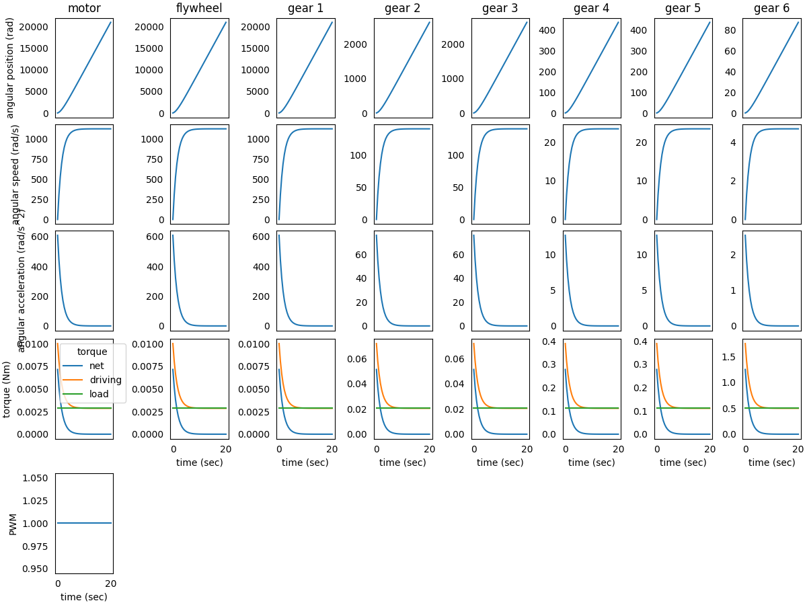

### System in Analysis

The complete example code is available 
[here](https://github.com/AndreaBlengino/gearpy/blob/master/docs/source/examples/1_simple_transmission_chain/simple_transmission_chain.py).  
The mechanical powertrain to be studied is reported in the image below:


The *flywheel* and the *gear 1* are connected to the *DC motor* output 
shaft and rotate with it. The *gear 2* mates with *gear 1* and is 
connected to *gear 3* through a rigid shaft, so *gear 2* and *gear 3* 
rotate together. The *gear 3* mates with *gear 4*, to which is connected
to *gear 5* through another rigid shaft, so *gear 4* and *gear 5* rotate 
together. Finally, *gear 5* mates with *gear 6*, which is connected to 
the external load.  
The analysis is focused on powertrain elements kinematics and torques.


### Model Set Up

As a first step, we instantiate the components of the mechanical 
powertrain:

```python
from gearpy.mechanical_objects import DCMotor, Flywheel, SpurGear
from gearpy.units import AngularSpeed, InertiaMoment, Torque

motor = DCMotor(name = 'motor',
                no_load_speed = AngularSpeed(15000, 'rpm'),
                maximum_torque = Torque(10, 'mNm'),
                inertia_moment = InertiaMoment(3, 'gcm^2'))
flywheel = Flywheel(name = 'flywheel',
                    inertia_moment = InertiaMoment(20, 'kgcm^2'))
gear_1 = SpurGear(name = 'gear 1',
                  n_teeth = 10,
                  inertia_moment = InertiaMoment(1, 'gcm^2'))
gear_2 = SpurGear(name = 'gear 2',
                  n_teeth = 80,
                  inertia_moment = InertiaMoment(3100, 'gcm^2'))
gear_3 = SpurGear(name = 'gear 3',
                  n_teeth = 10,
                  inertia_moment = InertiaMoment(4, 'gcm^2'))
gear_4 = SpurGear(name = 'gear 4',
                  n_teeth = 60,
                  inertia_moment = InertiaMoment(5000, 'gcm^2'))
gear_5 = SpurGear(name = 'gear 5',
                  n_teeth = 10,
                  inertia_moment = InertiaMoment(12, 'gcm^2'))
gear_6 = SpurGear(name = 'gear 6',
                  n_teeth = 50,
                  inertia_moment = InertiaMoment(7600, 'gcm^2'))
```

Then it is necessary to specify the connection types between the 
components. We choose to study a non-ideal powertrain so, in order to 
take into account power loss in matings due to friction, we specify a 
gear mating efficiency below `$100\%$`:

```python
from gearpy.utils import add_fixed_joint, add_gear_mating

add_fixed_joint(master = motor, slave = flywheel)
add_fixed_joint(master = flywheel, slave = gear_1)
add_gear_mating(master = gear_1, slave = gear_2, efficiency = 0.9)
add_fixed_joint(master = gear_2, slave = gear_3)
add_gear_mating(master = gear_3, slave = gear_4, efficiency = 0.9)
add_fixed_joint(master = gear_4, slave = gear_5)
add_gear_mating(master = gear_5, slave = gear_6, efficiency = 0.9)
```

We have to define the external load applied to *gear 6*. To keep the 
example simple, we can consider a constant load torque:

```python
def ext_torque(time, angular_position, angular_speed):
    return Torque(500, 'mNm')

gear_6.external_torque = ext_torque
 ```

Finally, it is necessary to combine all components in a powertrain 
object:

```python
from gearpy.powertrain import Powertrain

powertrain = Powertrain(motor = motor)
```

### Simulation Set Up

Before performing the simulation, it is necessary to specify the initial
condition of the system in terms of angular position and speed of the 
last gear in the mechanical powertrain. In this case we can consider 
the *gear 6* still in the reference position:

```python
from gearpy.units import AngularPosition

gear_6.angular_position = AngularPosition(0, 'rad')
gear_6.angular_speed = AngularSpeed(0, 'rad/s')
```

Finally, we have to set up the simulation parameters: the time 
discretization for the time integration and the simulation time. Now we 
are ready to run the simulation::

```python
from gearpy.units import TimeInterval
from gearpy.solver import Solver

solver = Solver(powertrain = powertrain)
solver.run(time_discretization = TimeInterval(0.5, 'sec'), 
           simulation_time = TimeInterval(20, 'sec'))
```

### Results Analysis

We can get a snapshot of the system at a particular time of interest:

```python
from gearpy.units import Time

powertrain.snapshot(target_time = Time(10, 'sec'))
```

```text
Mechanical Powertrain Status at Time = 10 sec
          angular position (rad)  angular speed (rad/s)  angular acceleration (rad/s^2)  torque (Nm)  driving torque (Nm)  load torque (Nm)  pwm
motor                9714.908984            1119.894923                        1.085094     0.000787             0.002871          0.002083  1.0
flywheel             9714.908984            1119.894923                        1.085094     0.000787             0.002871          0.002083     
gear 1               9714.908984            1119.894923                        1.085094     0.000787             0.002871          0.002083     
gear 2               1214.363623             139.986865                        0.135637     0.004001             0.020668          0.016667     
gear 3               1214.363623             139.986865                        0.135637     0.004001             0.020668          0.016667     
gear 4                202.393937              23.331144                        0.022606     0.011606             0.111606          0.100000     
gear 5                202.393937              23.331144                        0.022606     0.011606             0.111606          0.100000     
gear 6                 40.478787               4.666229                        0.004521     0.002227             0.502227          0.500000          
```

The default unit used for torques are not so convenient in this case, so 
we prefer to get results in a different unit:

```python
powertrain.snapshot(target_time = Time(10, 'sec'),
                    angular_position_unit = 'rot',
                    torque_unit = 'mNm',
                    driving_torque_unit = 'mNm',
                    load_torque_unit = 'mNm')
```

```text
Mechanical Powertrain Status at Time = 10 sec
          angular position (rot)  angular speed (rad/s)  angular acceleration (rad/s^2)  torque (mNm)  driving torque (mNm)  load torque (mNm)  pwm
motor                1546.175787            1119.894923                        1.085094      0.787194              2.870527           2.083333  1.0
flywheel             1546.175787            1119.894923                        1.085094      0.787194              2.870527           2.083333     
gear 1               1546.175787            1119.894923                        1.085094      0.787194              2.870527           2.083333     
gear 2                193.271973             139.986865                        0.135637      4.001131             20.667798          16.666667     
gear 3                193.271973             139.986865                        0.135637      4.001131             20.667798          16.666667     
gear 4                 32.211996              23.331144                        0.022606     11.606109            111.606109         100.000000     
gear 5                 32.211996              23.331144                        0.022606     11.606109            111.606109         100.000000     
gear 6                  6.442399               4.666229                        0.004521      2.227489            502.227489         500.000000          
```

Notice that the load torque applied on the *gear 6* is exactly the 
constant external torque we defined beforehand.  
About 10 seconds after the simulation start, the driving torque applied 
on *gear 6* is almost equal to the load torque on it, resulting in a 
very tiny angular acceleration. As a result, we can conclude that the 
system is almost in a stationary condition 10 seconds after the start.  
We can get a more general view of the system by plotting the time 
variables of each element with respect to time:

```python
powertrain.plot(figsize = (12, 9))
```



This plot is pretty crowded and we are not interested in all time 
variables, so we can focus the plot only on interesting elements and 
variables. We can also specify a more convenient unit to use when 
plotting torques:

```python
powertrain.plot(elements = ['gear 6', motor],
                variables = ['torque', 'driving torque', 'angular speed', 'load torque'],
                torque_unit = 'mNm',
                figsize = (8, 6))
```


Notice that we specified the elements either by the string name or by 
instance name, both ways work. Also notice that the plot automatically 
sorts:

- the elements: the motor on the left and following elements proceeding
to the right,
- the time variables: kinematic variables at the top, then torques 
grouped together in a single row and motor PWM in the last row.
  
We can see that at 10 seconds the angular speeds of *motor* and *gear 6* 
are almost constant, confirming the insight previously mentioned by 
analysing the time snapshot: at 10 seconds the system is almost in a 
stationary state.  
We can see that, as the time passes, the driving torque on *gear 6* 
equals the constant load torque and, as a results, the net torque on the
gear becomes close to zero.  
Notice that the driving torque developed by the motor does not equals 
the load torque: a difference between the two torque is established. 
This is due to the fact we used a non-optimal gear matings 
*gear 1*-*gear 2*, *gear 3*-*gear 4* and *gear 5*-*gear 6*, specifying 
a `$90\%$` efficiency in all cases. As a result, the motor must develop 
a torque slightly higher than what the load requires, in order to 
overcome the power loss for friction in the gear matings.
