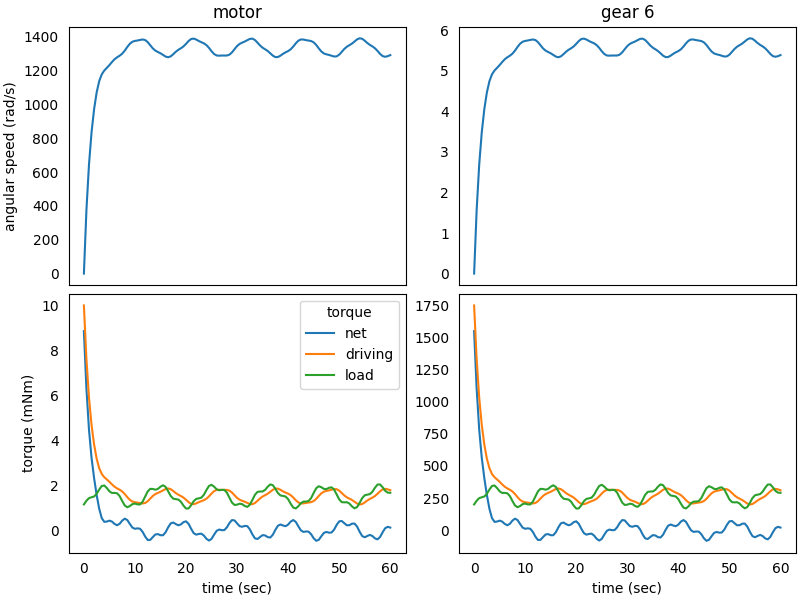

### System in Analysis

The complete example code is available 
[here](https://github.com/AndreaBlengino/gearpy/blob/master/docs/source/examples/2_complex_external_torque/complex_external_torque.py).  
The mechanical powertrain to be studied is the one described in the 
[1 - Simple Powertrain](https://gearpy.readthedocs.io/en/latest/examples/1_simple_powertrain/index.html) 
example.

### Model Set Up

We want to study the effect of a more complex external torque applied 
to the last gear in the powertrain. This complex torque has 4 main 
components:

  1. a 200 mNm constant value
  2. a periodic component dependent on the last gear's angular position, 
     with a 60 rad period and an 80 mNm amplitude, due to the presence of 
     cams in the mechanism
  3. a component proportional to the square of the last gear's angular 
     speed, with a 2 mNm s²/rad², due to the effect of air friction
  4. a periodic component dependent on the simulation time, with a 2 sec
     period and a 20 mNm amplitude, which accounts for a load which 
     depends periodically on time

```python
import numpy as np

def ext_torque(time, angular_position, angular_speed):
    return Torque(value = 200 +
                          80*angular_position.sin(frequency = 1/60) +
                          2*angular_speed.to('rad/s').value**2 +
                          20*np.sin(2*np.pi/3*time.to('sec').value),
                  unit = 'mNm')

gear_6.external_torque = ext_torque
```

The remaining set-ups of the model stay the same.

### Results Analysis

We can get a snapshot of the system at a particular time of interest:

```python
powertrain.snapshot(target_time = Time(10, 'sec'),
                    angular_position_unit = 'rot',
                    torque_unit = 'mNm',
                    driving_torque_unit = 'mNm',
                    load_torque_unit = 'mNm')
```

```text
Mechanical Powertrain Status at Time = 10 sec
          angular position (rot)  angular speed (rad/s)  angular acceleration (rad/s^2)  torque (mNm)  driving torque (mNm)  load torque (mNm)  pwm
motor                1831.919043            1375.840709                        5.011918      0.058805              1.241126           1.182321  1.0
flywheel             1831.919043            1375.840709                        5.011918      0.058805              1.241126           1.182321     
gear 1               1831.919043            1375.840709                        5.011918      0.058805              1.241126           1.182321     
gear 2                228.989880             171.980089                        0.626490      0.423395              8.936107           8.512712     
gear 3                228.989880             171.980089                        0.626490      0.423395              8.936107           8.512712     
gear 4                 38.164980              28.663348                        0.104415      2.286335             48.254979          45.968644     
gear 5                 38.164980              28.663348                        0.104415      2.286335             48.254979          45.968644     
gear 6                  7.632996               5.732670                        0.020883     10.288508            217.147407         206.858899               
```

We can get a more general view of the system by plotting the time 
variables and focus the plot only on interesting elements and variables. 
We can also specify a more convenient unit to use when plotting torques:

```python
powertrain.plot(elements = ['gear 6', motor],
                variables = ['torque', 'driving torque', 'angular speed', 'load torque'],
                torque_unit = 'mNm',
                figsize = (8, 6))
```



We can appreciate the complex shape of the load torque and its effect on
the system. There is a start-up transient up until 10 seconds from the 
simulation start, then the system reaches a dynamic equilibrium 
condition, where there are fluctuations in the external torque, but the
angular speed mean is constant.  
As time passes, the driving torque on the *gear 6* equals the load 
torque mean value and, as a result, the net torque tends to zero, with 
small oscillations around this value. The same happens on the *motor* 
except for a gap between driving and load torque, due to the gear mating 
efficiency.  
