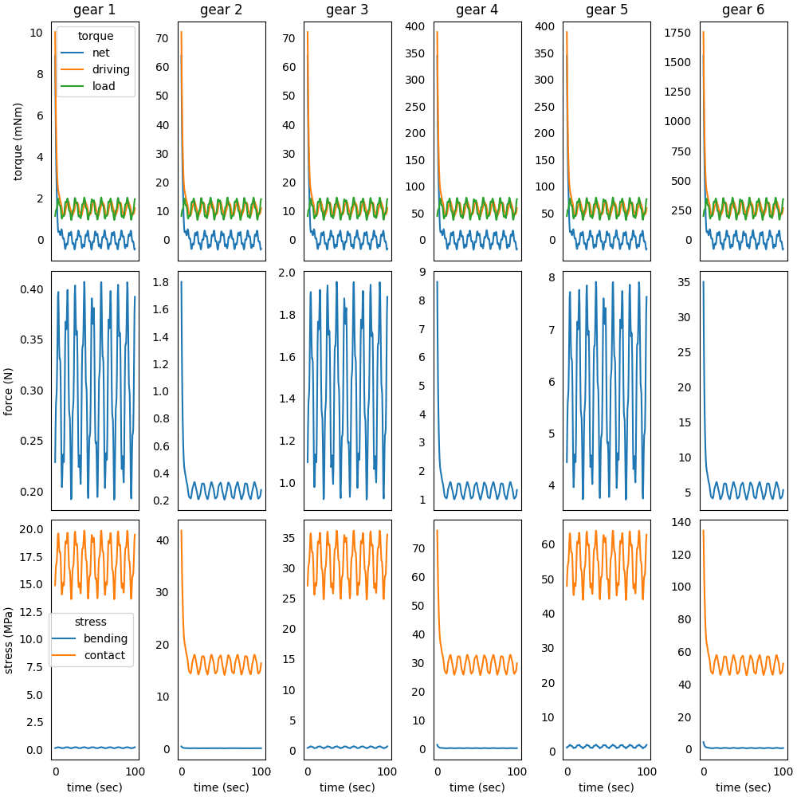

### System in Analysis

The complete example code is available
[here](https://github.com/AndreaBlengino/gearpy/blob/master/docs/source/examples/3_gear_structural_analysis/gear_structural_analysis.py).  
The mechanical powertrain to be studied is the one described in the 
[2 - Complex External Torque](https://gearpy.readthedocs.io/en/latest/examples/2_complex_external_torque/index.html) 
example.  
The teeth of all gears must be verified for static bending and contact 
stress with a safety factor **1.5**.  

### Model Set Up

We want to deep dive the analysis on gears structural strength. In order
to take into account these computation, we have to edit the gear 
definitions, to include some required data:

```python
from gearpy.units import Length, Stress

gear_1 = SpurGear(name = 'gear 1',
                  n_teeth = 10,
                  inertia_moment = InertiaMoment(1, 'gcm^2'),
                  module = Length(1, 'mm'),
                  face_width = Length(10, 'mm'),
                  elastic_modulus = Stress(200, 'GPa'))
gear_2 = SpurGear(name = 'gear 2',
                  n_teeth = 80,
                  inertia_moment = InertiaMoment(3100, 'gcm^2'),
                  module = Length(1, 'mm'),
                  face_width = Length(10, 'mm'),
                  elastic_modulus = Stress(200, 'GPa'))
gear_3 = SpurGear(name = 'gear 3',
                  n_teeth = 10,
                  inertia_moment = InertiaMoment(4, 'gcm^2'),
                  module = Length(1.5, 'mm'),
                  face_width = Length(10, 'mm'),
                  elastic_modulus = Stress(200, 'GPa'))
gear_4 = SpurGear(name = 'gear 4',
                  n_teeth = 60,
                  inertia_moment = InertiaMoment(5000, 'gcm^2'),
                  module = Length(1.5, 'mm'),
                  face_width = Length(10, 'mm'),
                  elastic_modulus = Stress(200, 'GPa'))
gear_5 = SpurGear(name = 'gear 5',
                  n_teeth = 10,
                  inertia_moment = InertiaMoment(12, 'gcm^2'),
                  module = Length(2, 'mm'),
                  face_width = Length(10, 'mm'),
                  elastic_modulus = Stress(200, 'GPa'))
gear_6 = SpurGear(name = 'gear 6',
                  n_teeth = 50,
                  inertia_moment = InertiaMoment(7600, 'gcm^2'),
                  module = Length(2, 'mm'),
                  face_width = Length(10, 'mm'),
                  elastic_modulus = Stress(200, 'GPa'))
```

All gears are made in steel, which yield stress is 250 MPa.  
The remaining set up of the model stay the same.

### Results Analysis

We can get a snapshot of the system at a particular time of interest:

```python
powertrain.snapshot(target_time = Time(10, 'sec'),
                    torque_unit = 'mNm',
                    driving_torque_unit = 'mNm',
                    load_torque_unit = 'mNm')
```

```text
Mechanical Powertrain Status at Time = 10 sec
          angular position (rad)  angular speed (rad/s)  angular acceleration (rad/s^2)  torque (mNm)  driving torque (mNm)  load torque (mNm) tangential force (N) bending stress (MPa) contact stress (MPa)  pwm
motor               11510.286813            1375.840709                        5.011918      0.379214              1.241126           0.861912                                                                 1.0
flywheel            11510.286813            1375.840709                        5.011918      0.379214              1.241126           0.861912                                                                    
gear 1              11510.286813            1375.840709                        5.011918      0.379214              1.241126           0.861912             0.172382             0.085762            12.916978     
gear 2               1438.785852             171.980089                        0.626490      2.040811              8.936107           6.895297             0.223403             0.051239            14.704783     
gear 3               1438.785852             171.980089                        0.626490      2.040811              8.936107           6.895297             0.919373             0.304933            24.803432     
gear 4                239.797642              28.663348                        0.104415      6.883200             48.254979          41.371780             1.072333             0.169807            26.787411     
gear 5                239.797642              28.663348                        0.104415      6.883200             48.254979          41.371780             4.137178             1.029149            46.213185     
gear 6                 47.959528               5.732670                        0.020883     10.288508            217.147407         206.858899             4.342948             0.532224            47.348488     
```

We can get a more general view of the system by plotting the time 
variables and focus the plot only on interesting elements and variables. 
We can also specify a more convenient unit to use when plotting torques:

```python
powertrain.plot(figsize = (12, 8),
                elements = [gear_1, gear_2, gear_3, gear_4, gear_5, gear_6],
                angular_position_unit = 'rot',
                torque_unit = 'mNm',
                variables = ['driving torque', 'load torque', 'torque', 'tangential force', 'bending stress',
                             'contact stress'])
```



We can appreciate how the torques, forces and stresses vary over time, 
and in particular there is a peak in some variables at the beginning of
the simulation.  
We can see that the torques, forces and stresses are low in the first
gears, and increase in the last gears, so we can draw a more clean plot
and focus on the last two gears only:

```python
powertrain.plot(figsize = (12, 8),
                elements = [gear_5, gear_6],
                angular_position_unit = 'rot',
                torque_unit = 'mNm',
                variables = ['driving torque', 'load torque', 'torque', 'tangential force', 'bending stress',
                             'contact stress'])
```


The maximum contact stress is about 135 MPa on the *gear 6* resulting in 
a safety factor about 1.85, higher than the target 1.5. The bending 
stresses are even lower on all gears.   
We can consider these gears correctly designed for the considered 
application.
