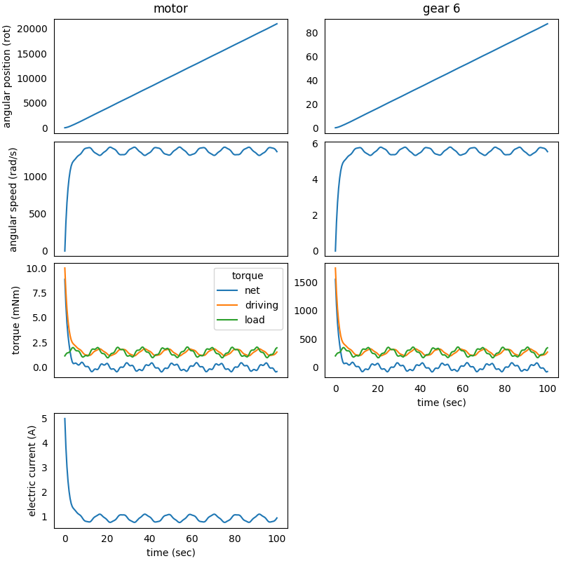

### System in Analysis

The complete example code is available
[here](https://github.com/AndreaBlengino/gearpy/blob/master/docs/source/examples/4_dc_motor_electric_analysis/dc_motor_electric_analysis.py).  
The mechanical powertrain to be studied is the one described in the 
[2 - Complex External Torque](https://gearpy.readthedocs.io/en/latest/examples/2_complex_external_torque/index.html) 
example.  

### Model Set Up

We want to deep dive the analysis on the DC motor's electric current. 
In order to take into account these computation, we have to edit the 
motor definition, to include some required data:

```python
from gearpy.units import Current

motor = DCMotor(name = 'motor',
                no_load_speed = AngularSpeed(15000, 'rpm'),
                maximum_torque = Torque(10, 'mNm'),
                inertia_moment = InertiaMoment(3, 'gcm^2'),
                no_load_electric_current = Current(200, 'mA'),
                maximum_electric_current = Current(5, 'A'))
```

The remaining set up of the model stay the same.

### Results Analysis

We can get a snapshot of the system at a particular time of interest:

```python
powertrain.snapshot(target_time = Time(10, 'sec'),
                    torque_unit = 'mNm',
                    driving_torque_unit = 'mNm',
                    load_torque_unit = 'mNm')
```

```text
Mechanical Powertrain Status at Time = 10 sec
          angular position (rad)  angular speed (rad/s)  angular acceleration (rad/s^2)  torque (mNm)  driving torque (mNm)  load torque (mNm) electric current (A)  pwm
motor               11510.286813            1375.840709                        5.011918      0.058805              1.241126           1.182321              0.79574  1.0
flywheel            11510.286813            1375.840709                        5.011918      0.058805              1.241126           1.182321                          
gear 1              11510.286813            1375.840709                        5.011918      0.058805              1.241126           1.182321                          
gear 2               1438.785852             171.980089                        0.626490      0.423395              8.936107           8.512712                          
gear 3               1438.785852             171.980089                        0.626490      0.423395              8.936107           8.512712                          
gear 4                239.797642              28.663348                        0.104415      2.286335             48.254979          45.968644                          
gear 5                239.797642              28.663348                        0.104415      2.286335             48.254979          45.968644                          
gear 6                 47.959528               5.732670                        0.020883     10.288508            217.147407         206.858899                                                         
```

We can get a more general view of the system by plotting the time 
variables and focus the plot only on interesting elements and variables. 
We can also specify a more convenient unit to use when plotting torques:

```python
powertrain.plot(figsize = (12, 10),
                elements = [motor, gear_6],
                angular_position_unit = 'rot',
                torque_unit = 'mNm',
                variables = ['angular position', 'angular speed', 'driving torque', 'load torque', 'torque',
                             'electric current'])
```



We can appreciate how the electric current absorbed by the DC motor 
varies over time, and in particular there is a peak in absorption at the 
beginning of the simulation, when the DC motor starts up. In the 
following moments of the simulation, the absorbed current value 
oscillates because it is affected by the oscillating nature of the 
external load applied to *gear 6*.  
 