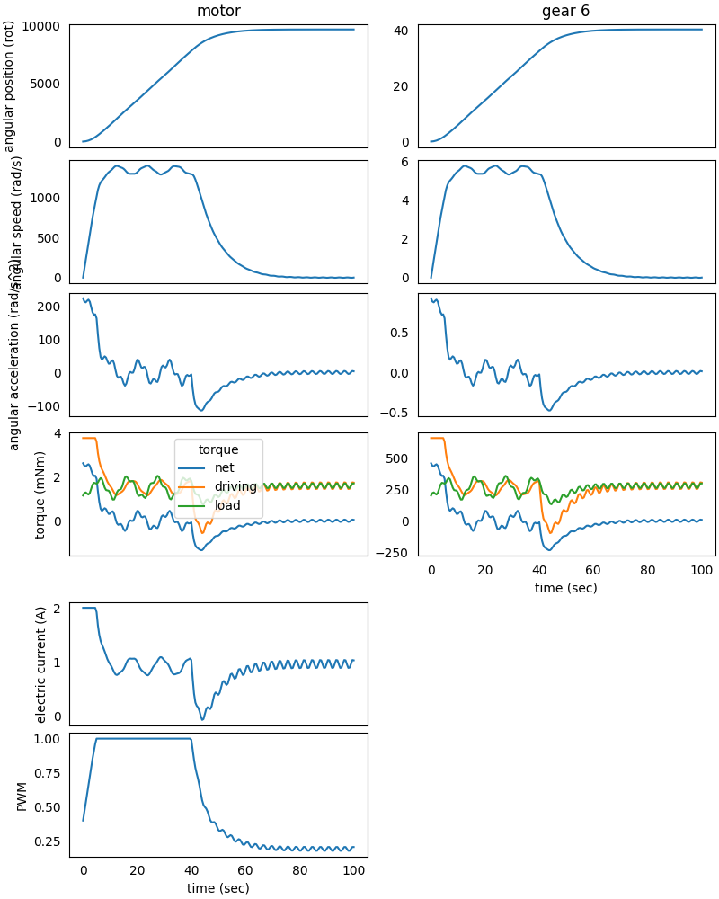

### System in Analysis

The mechanical powertrain to be studied is the one described in the 
[4 - DC Motor Electric Analysis](https://gearpy.readthedocs.io/en/latest/examples/4_dc_motor_electric_analysis/index.html) 
example.  
In that example, the motor absorbs its *maximum electric current* at the
start up, 5 A, which may be too much for the system. Such a high current
may demagnetize the magnet inside the motor itself, so we want to keep 
the absorbed current lower to prevent this issue. In order to do that,
we can control the motor supply voltage through the PWM.  
This control can be also used to make the powertrain reach a specific
target position.

### Model Set Up

We can start by limiting the start up absorbed current through a rule 
that maintains the PWM proportional to the angular position of a gear, 
for example the *gear 6*, to which is attached an encoder that measure
the gear angular position:

```python
from gearpy.sensors import AbsoluteRotaryEncoder
from gearpy.motor_control.rules import StartProportionalToAngularPosition

encoder = AbsoluteRotaryEncoder(target = gear_6)

start_1 = StartProportionalToAngularPosition(encoder = encoder,
                                             powertrain = powertrain,
                                             target_angular_position = AngularPosition(10, 'rot'),
                                             pwm_min_multiplier = 5)
```

At the start up the motor is supplied with a PWM that is 5 times its 
minimum PWM and it increases up to 1 when the *gear 6* approaches 10 
rotations from the reference position.  
This rule has to be passed to the PWM control:

```python
from gearpy.motor_control import PWMControl

motor_control_1 = PWMControl(powertrain = powertrain)
motor_control_1.add_rule(rule = start_1)
``` 

### Simulation Set Up

The only modification to the simulation set up consist of passing the 
motor control object the the solver at instantiation, the remaining set 
up stay the same:

```python
solver = Solver(powertrain = powertrain, motor_control = motor_control_1)
```

### Results Analysis

We can get a general view of the system by plotting the time variables 
and focus the plot only on interesting elements and variables. We can 
also specify a more convenient unit to use when plotting torques:

```python
powertrain.plot(figsize = (12, 8),
                elements = ['motor', 'gear 6'],
                angular_position_unit = 'rot',
                torque_unit = 'mNm',
                variables = ['angular position', 'angular speed', 'angular acceleration',
                             'driving torque', 'load torque', 'torque', 'electric current', 'pwm'])
```


We can appreciate how the PWM starts from about 0.75 at the beginning of
the simulation and increases up to 1 after about 15 seconds from the 
simulation start. At the same time, the electric current peak at the 
beginning of the simulation is decreased from 5 A to about 3.8 A, as 
desired.  

### Improved Model Set Up

However, this method is not so effective, since there still is an 
electric current peak and the electric current is not strictly 
controlled. If we can attach a tachometer to an element of the system, 
then we can replace the previous rule with another one, which lets us 
better control the electric current:

```python
from gearpy.sensors import Tachometer

tachometer = Tachometer(target = motor)

start_2 = StartLimitCurrent(encoder = encoder,
                            tachometer = tachometer,
                            motor = motor,
                            limit_electric_current = Current(2, 'A'),
                            target_angular_position = AngularPosition(10, 'rot'))
```
 
This rule let us limit the maximum electric current absorbed by the 
motor to 2 A up until the *gear 6* (to which is attached the encoder) 
reaches 10 rotations from the reference position.  
Moreover, we want to add a second rule to make the *gear 6* reach a 
specific final position and stay there:

```python
from gearpy.motor_control import ReachAngularPosition

reach_position = ReachAngularPosition(encoder = encoder,
                                      powertrain = powertrain,
                                      target_angular_position = AngularPosition(40, 'rot'),
                                      braking_angle = Angle(10, 'rot'))
```

With this rule, the DC motor's PWM is controlled in order to make the 
*gear 6* reach 40 rotations from the reference position and the whole
system will begin to brake 10 rotation before the target.  
Finally, we have to add this two rules to a new motor control:

```python
motor_control_2 = PWMControl(powertrain = powertrain)
motor_control_2.add_rule(rule = start_2)
motor_control_2.add_rule(rule = reach_position)
``` 

### Simulation Set Up

We have to reset the previous simulation result and update the solver
instantiation with the new motor control:

```python
powertrain.reset()

solver = Solver(powertrain = powertrain, motor_control = motor_control_2)
```

The remaining set up of the model stay the same.

### Results Analysis

We can get the updated plot with the same code:

```python
powertrain.plot(figsize = (12, 8),
                elements = ['motor', 'gear 6'],
                angular_position_unit = 'rot',
                torque_unit = 'mNm',
                variables = ['angular position', 'angular speed', 'angular acceleration',
                             'driving torque', 'load torque', 'torque', 'electric current', 'pwm'])
```



This time the PWM is controlled in a different manner and we can 
appreciate how the electric current is always lower than 2 A at the 
beginning of the simulation.  
At 40 seconds from the simulation start, the system starts to brake in 
order to reach the final position of the *gear 6* at 40 rotations from 
the reference position, as specified in the rule.
