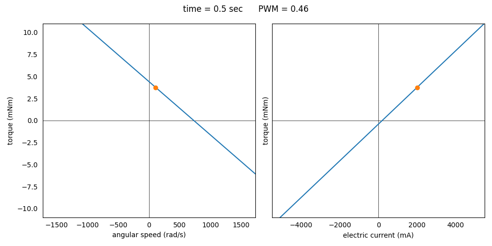

### System in Analysis

The mechanical transmission to be studied is the one described in the 
**5 - DC Motor PWM Control** example.  

### Model Set Up

We can get an animation of the DC motor's working characteristics:

```python
from gearpy.utils import dc_motor_characteristics_animation

dc_motor_characteristics_animation(motor = motor,
                                   time = transmission.time,
                                   interval = 10,
                                   figsize = (10, 5),
                                   torque_unit = 'mNm',
                                   current_unit = 'mA')
```



On the left hand side there is the torque-speed characteristic, while on
the right hand side there is the torque-current characteristic and the 
orange dot is the working point of the motor. The characteristics can 
vary based on the PWM value.
