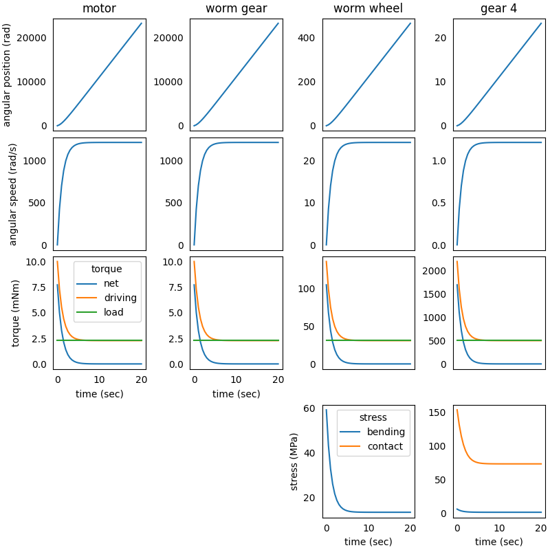

### System in Analysis

The complete example code is available 
[here](https://github.com/AndreaBlengino/gearpy/blob/master/docs/source/examples/7_worm_and_helical_gears/worm_and_helical_gears.py).  
The mechanical powertrain to be studied is reported in the image below:


The *flywheel* and the *worm gear* are connected to the *DC motor* output 
shaft and rotate with it. The *worm gear* mates with the *worm wheel*,
which is connected to *gear 1* through a rigid shaft, so the *worm wheel*
and the *gear 1* rotate together. The *gear 2* mates with *gear 1* and is 
connected to *gear 3* through a rigid shaft, so *gear 2* and *gear 3* 
rotate together. Finally, *gear 3* mates with *gear 4*, which is connected 
to the external load.  
*gear 1*, *gear 2*, *gear 3* and *gear 4* are helical gears.  
The analysis is focused on powertrain elements kinematics, torques and 
stresses.


### Model Set Up

As a first step, we instantiate the components of the mechanical 
powertrain:

```python
from gearpy.mechanical_objects import DCMotor, Flywheel, HelicalGear, WormGear, WormWheel
from gearpy.units import Angle, AngularSpeed, InertiaMoment, Length, Stress, Torque

motor = DCMotor(name = 'motor',
                no_load_speed = AngularSpeed(15000, 'rpm'),
                maximum_torque = Torque(10, 'mNm'),
                inertia_moment = InertiaMoment(3, 'gcm^2'))
flywheel = Flywheel(name = 'flywheel',
                    inertia_moment = InertiaMoment(20, 'kgcm^2'))
worm_gear = WormGear(name = 'worm gear',
                     n_starts = 1,
                     inertia_moment = InertiaMoment(3, 'gcm^2'),
                     pressure_angle = Angle(20, 'deg'),
                     helix_angle = Angle(10, 'deg'),
                     reference_diameter = Length(10, 'mm'))
worm_wheel = WormWheel(name = 'worm wheel',
                       n_teeth = 50,
                       inertia_moment = InertiaMoment(500, 'gcm^2'),
                       pressure_angle = Angle(20, 'deg'),
                       helix_angle = Angle(10, 'deg'),
                       module = Length(1, 'mm'),
                       face_width = Length(10, 'mm'))
gear_1 = HelicalGear(name = 'gear 1',
                     n_teeth = 10,
                     inertia_moment = InertiaMoment(2, 'gcm^2'),
                     helix_angle = Angle(20, 'deg'),
                     module = Length(1, 'mm'),
                     face_width = Length(15, 'mm'),
                     elastic_modulus = Stress(200, 'GPa'))
gear_2 = HelicalGear(name = 'gear 2',
                     n_teeth = 50,
                     inertia_moment = InertiaMoment(750, 'gcm^2'),
                     helix_angle = Angle(20, 'deg'),
                     module = Length(1, 'mm'),
                     face_width = Length(15, 'mm'),
                     elastic_modulus = Stress(200, 'GPa'))
gear_3 = HelicalGear(name = 'gear 3',
                     n_teeth = 10,
                     inertia_moment = InertiaMoment(8, 'gcm^2'),
                     helix_angle = Angle(20, 'deg'),
                     module = Length(1.5, 'mm'),
                     face_width = Length(20, 'mm'),
                     elastic_modulus = Stress(200, 'GPa'))
gear_4 = HelicalGear(name = 'gear 4',
                     n_teeth = 40,
                     inertia_moment = InertiaMoment(2000, 'gcm^2'),
                     helix_angle = Angle(20, 'deg'),
                     module = Length(1.5, 'mm'),
                     face_width = Length(20, 'mm'),
                     elastic_modulus = Stress(200, 'GPa'))
```

Then it is necessary to specify the connection types between the 
components. We choose to study a non-ideal powertrain so, in order to 
take into account power loss in matings due to friction, we specify a 
gear mating efficiency below `$100\%$` and a friction coefficient in 
the worm gear mating:

```python
from gearpy.utils import add_fixed_joint, add_gear_mating, add_worm_gear_mating

add_fixed_joint(master = motor, slave = flywheel)
add_fixed_joint(master = flywheel, slave = worm_gear)
add_worm_gear_mating(master = worm_gear, slave = worm_wheel, friction_coefficient = 0.4)
add_fixed_joint(master = worm_wheel, slave = gear_1)
add_gear_mating(master = gear_1, slave = gear_2, efficiency = 0.9)
add_fixed_joint(master = gear_2, slave = gear_3)
add_gear_mating(master = gear_3, slave = gear_4, efficiency = 0.9)
```

We have to define the external load applied to *gear 4*. To keep the 
example simple, we can consider a constant load torque:

```python
def ext_torque(time, angular_position, angular_speed):
    return Torque(500, 'mNm')

gear_4.external_torque = ext_torque
 ```

Finally, it is necessary to combine all components in a powertrain 
object:

```python
from gearpy.powertrain import Powertrain

powertrain = Powertrain(motor = motor)
```

### Simulation Set Up

Before performing the simulation, it is necessary to specify the initial
condition of the system in terms of angular position and speed of the 
last gear in the mechanical powertrain. In this case we can consider 
the *gear 4* still in the reference position:

```python
from gearpy.units import AngularPosition

gear_4.angular_position = AngularPosition(0, 'rad')
gear_4.angular_speed = AngularSpeed(0, 'rad/s')
```

Finally, we have to set up the simulation parameters: the time 
discretization for the time integration and the simulation time. Now we 
are ready to run the simulation::

```python
from gearpy.units import TimeInterval
from gearpy.solver import Solver

solver = Solver(powertrain = powertrain)
solver.run(time_discretization = TimeInterval(0.5, 'sec'), 
           simulation_time = TimeInterval(20, 'sec'))
```

### Results Analysis

We can get a snapshot of the system at a particular time of interest:

```python
from gearpy.units import Time

powertrain.snapshot(target_time = Time(10, 'sec'),
                    angular_position_unit = 'rot',
                    torque_unit = 'mNm',
                    driving_torque_unit = 'mNm',
                    load_torque_unit = 'mNm')
```

```text
Mechanical Powertrain Status at Time = 10 sec
            angular position (rot)  angular speed (rad/s)  angular acceleration (rad/s^2)  torque (mNm)  driving torque (mNm)  load torque (mNm) tangential force (N) bending stress (MPa) contact stress (MPa)  pwm
motor                  1750.283916            1212.664997                        0.158727      0.001448              2.279935           2.278487                                                                 1.0
flywheel               1750.283916            1212.664997                        0.158727      0.001448              2.279935           2.278487                                                                    
worm gear              1750.283916            1212.664997                        0.158727      0.001448              2.279935           2.278487                                                                    
worm wheel               35.005678              24.253300                        0.003175      0.019617             30.883814          30.864198             1.235353            13.519356                          
gear 1                   35.005678              24.253300                        0.003175      0.019617             30.883814          30.864198              6.17284             1.697105            61.723522     
gear 2                    7.001136               4.850660                        0.000635      0.088274            138.977163         138.888889             5.559087             0.881963             58.57468     
gear 3                    7.001136               4.850660                        0.000635      0.088274            138.977163         138.888889            18.518519             2.545658            77.154403     
gear 4                    1.750284               1.212665                        0.000159      0.317788            500.317788         500.000000             16.67726             1.377898             73.21835               
```

Notice that the load torque applied on the *gear 4* is exactly the 
constant external torque we defined beforehand.  
About 10 seconds after the simulation start, the driving torque applied 
on *gear 4* is almost equal to the load torque on it, resulting in a 
very tiny angular acceleration. As a result, we can conclude that the 
system is almost in a stationary condition 10 seconds after the start.  
We can get a more general view of the system by plotting the time 
variables of each element with respect to time:

```python
powertrain.plot(elements = [motor, worm_gear, worm_wheel, gear_4],
                variables = ['angular position', 'angular speed', 'torque', 'driving torque', 'load torque',
                             'bending stress', 'contact stress'],
                torque_unit = 'mNm',
                figsize = (10, 8))
```



We can see that at 10 seconds the angular speeds of *motor* and *gear 4* 
are almost constant, confirming the insight previously mentioned by 
analysing the time snapshot: at 10 seconds the system is almost in a 
stationary state.  
We can see that, as the time passes, the driving torque on *gear 4* 
equals the constant load torque and, as a results, the net torque on the
gear becomes close to zero.  
Notice that the bending and contact stress are available for all gears
and the bending stress has been computed for the *worm wheel*.
