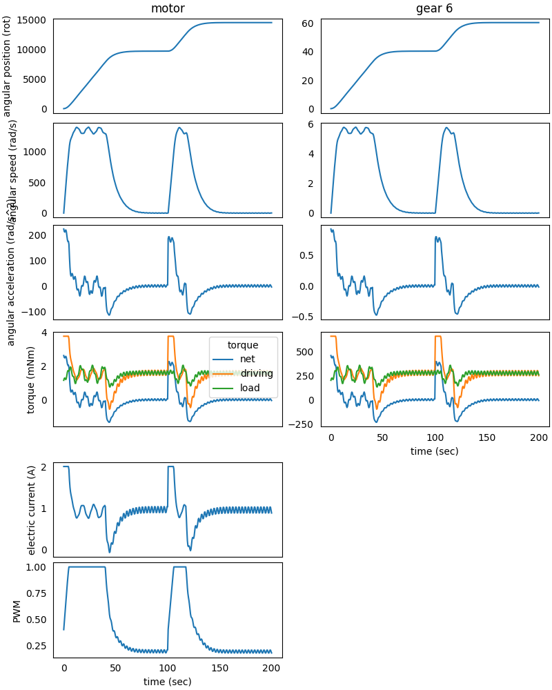

### System in Analysis

The complete example code is available
[here](https://github.com/AndreaBlengino/gearpy/blob/master/docs/source/examples/8_multiple_simulation_concatenation/multiple_simulation_concatenation.py).  
The mechanical powertrain to be studied is the one described in the 
[5 - DC Motor PWM Control](https://gearpy.readthedocs.io/en/latest/examples/5_dc_motor_pwm_control/index.html) 
example.  
In that example, the motor is controlled in order to keep the electric
current absorption below a threshold and to make the *gear 6* reach a 
specific final position and stay there.  
After this simulation, we want to run a second simulation step, starting
from the results of the first step. In this second step, the motor is 
still controlled in order to keep the current absorption below a 
threshold and to make the *gear 6* reach another specific final 
position.  
In order to analyze these steps, we need to concatenate two different 
simulation.

### Second Step Model Set Up

After running the first step simulation, we can prepare the motor 
controls for the second step by setting up the electric current 
absorption limit to 2 A and the second target position for the *gear 6* 
to 60 rotations from the reference position:

```python
start_2 = StartLimitCurrent(encoder = encoder,
                          tachometer = tachometer,
                          motor = motor,
                          limit_electric_current = Current(2, 'A'),
                          target_angular_position = AngularPosition(50, 'rot'))

reach_position_2 = ReachAngularPosition(encoder = encoder,
                                        powertrain = powertrain,
                                        target_angular_position = AngularPosition(60, 'rot'),
                                        braking_angle = Angle(10, 'rot'))

motor_control_2 = PWMControl(powertrain = powertrain)
motor_control_2.add_rule(rule = start_2)
motor_control_2.add_rule(rule = reach_position_2)
```

### Simulation Set Up

It is important to not reset the previous results, since we want to 
concatenate the new simulation results to these; so we only need to 
update the solver simulation parameters with the new motor control:

```python
solver.run(time_discretization = TimeInterval(0.5, 'sec'),
           simulation_time = TimeInterval(100, 'sec'),
           motor_control = motor_control_2)
```

The remaining set-ups of the model stay the same.

### Results Analysis

We can get the updated plot with the same code:

```python
powertrain.plot(figsize = (8, 10),
                elements = ['motor', 'gear 6'],
                angular_position_unit = 'rot',
                torque_unit = 'mNm',
                variables = ['angular position', 'angular speed', 'angular acceleration',
                             'driving torque', 'load torque', 'torque', 'electric current', 'pwm'])
```



We can see the results of the first simulation up until 100 seconds from 
the start, where the powertrain starts up and make the *gear 6* reach 
the destination at 40 rotations from the reference position, while 
keeping the motor electric current absorption below 2 A.  
From 100 seconds up to the end, we can see the results from the second 
simulation, where the powertrain starts up again in order to make the 
*gear 6* reach the second destination at 60 rotations from the reference 
position and still keeping the motor electric current absorption below 
2 A.  
The second step of the simulation depends on the first one only by the 
powertrain elements initial conditions (positions, speeds and 
accelerations); so the external load can be changed and also the solver 
parameters, like the simulation time and discretization.
