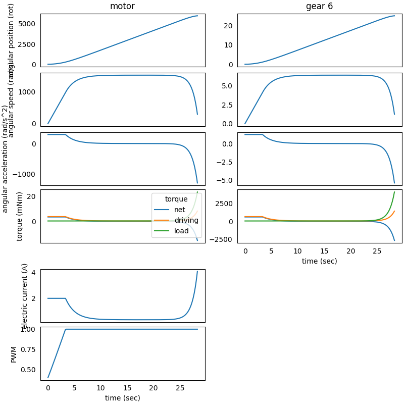

### System in Analysis

The complete example code is available
[here](https://github.com/AndreaBlengino/gearpy/blob/master/docs/source/examples/9_stop_simulation/stop_simulation.py).  
The mechanical powertrain to be studied is the one described in the 
[5 - DC Motor PWM Control](https://gearpy.readthedocs.io/en/latest/examples/5_dc_motor_pwm_control/index.html) 
example.  
In that example, the motor is controlled in order to keep the electric
current absorption below a threshold and to make the *gear 6* reach a 
specific final position and stay there.  
We want to keep the current absorption control at the motor start-up and 
apply an increasing load torque to the powertrain.  
As the load torque increases, the motor current absorption does too, and 
we want to stop the simulation if this absorption overcome a specific
threshold.

### Second Step Model Set Up

We can define the increasing load torque as following:

```python
import numpy as np

def ext_torque(time, angular_position, angular_speed):
    return Torque(value = 50 + np.exp(time.to('sec').value - 20),
                  unit = 'mNm')

gear_6.external_torque = ext_torque
```

In order to use the motor absorbed current as stopping condition for the
simulation, we have to measure this current absorption, so we have to
instantiate an amperometer:

```python
from gearpy.sensors import  Amperometer

amperometer = Amperometer(target = motor)
```

See :py:class:`Amperometer <gearpy.sensors.amperometer.Amperometer>` for 
more details on instantiation parameters.  
Then, we have to define the simulation stopping condition:

```python
from gearpy.utils import StopCondition

stop_condition = StopCondition(sensor = amperometer,
                               threshold = Current(4, 'A'),
                               operator = StopCondition.greater_than_or_equal_to)
```

See 
:py:class:`StopCondition <gearpy.utils.stop_condition.stop_condition.StopCondition>` 
for more details on instantiation parameters.  
In this specific case, the solver will stop the computation if the 
measured absorbed current is greater than or equal to 4 A.  
We also apply a PWM motor control at the powertrain start-up, in order 
to limit the motor current absorption below 2 A:

```python
from gearpy.sensors import AbsoluteRotaryEncoder, Tachometer
from gearpy.motor_control.rules import StartLimitCurrent
from gearpy.motor_control import PWMControl

encoder = AbsoluteRotaryEncoder(target = gear_6)
tachometer = Tachometer(target = motor)

start = StartLimitCurrent(encoder = encoder,
                          tachometer = tachometer,
                          motor = motor,
                          limit_electric_current = Current(2, 'A'),
                          target_angular_position = AngularPosition(10, 'rot'))

motor_control = PWMControl(powertrain = powertrain)
motor_control.add_rule(rule = start)
```

### Simulation Set Up

Finally, we can run the simulation by passing the defined motor control
and the stopping condition to the solver:

```python
solver.run(time_discretization = TimeInterval(0.1, 'sec'),
           simulation_time = TimeInterval(100, 'sec'),
           motor_control = motor_control,
           stop_condition = stop_condition)
```

The time discretization is quite fine in order to grasp the rapidly
increasing load torque. Notice the simulation time is 100 seconds.  
The remaining set-ups of the model stay the same.

### Results Analysis

We can get the updated plot with the same code:

```python
powertrain.plot(figsize = (8, 8),
                elements = ['motor', 'gear 6'],
                angular_position_unit = 'rot',
                torque_unit = 'mNm',
                variables = ['angular position', 'angular speed', 'angular acceleration',
                             'driving torque', 'load torque', 'torque', 'electric current', 'pwm'])
```



We can see that the motor PWM control is limiting the current absorption 
below 2 A at the start-up, up until 4 seconds, then the powertrain 
reaches a stationary working condition.  
Around 25 seconds after the start-up, the load torque is increasing, and 
it is no more negligible. In fact, also the motor absorbed current is 
increasing up to 4 A, after which the simulation is stopped as desired, 
even if the solver simulation time was set to 100 seconds.  
The simulation stopping condition can be based on a current, an angular 
position or an angular speed; so it is required to respectively pass an 
amperometer, an encoder or a tachometer to the 
:py:class:`StopCondition <gearpy.utils.stop_condition.stop_condition.StopCondition>` 
object.
