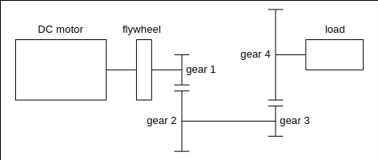
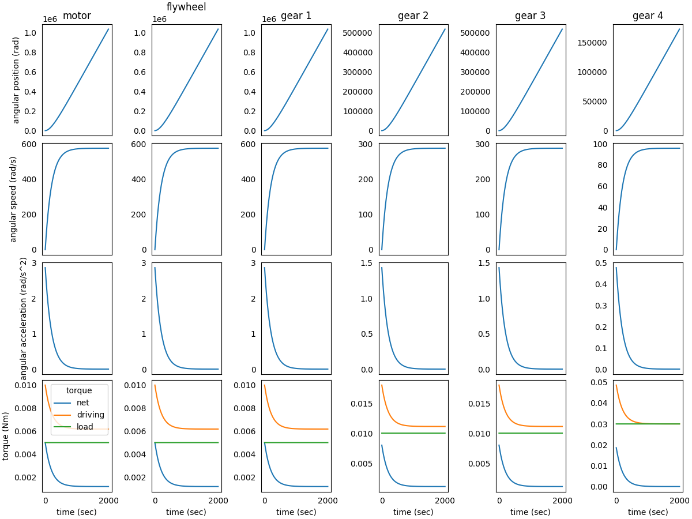
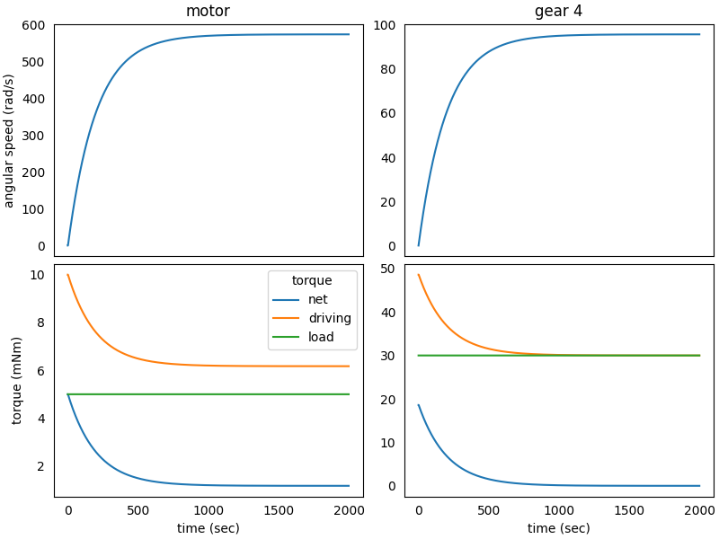
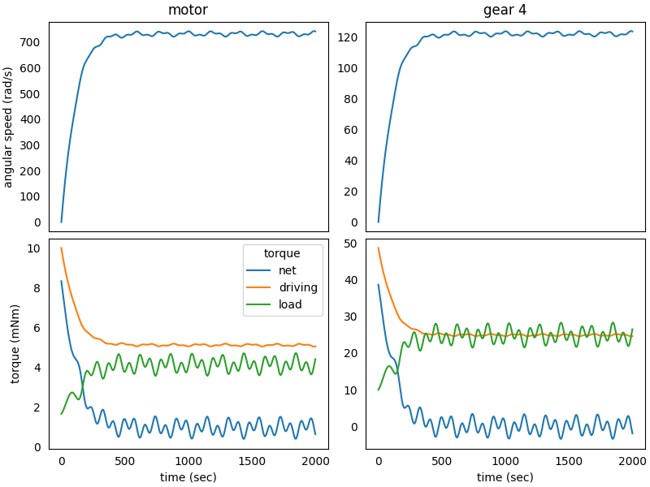

### System in Analysis

The mechanical transmission to be studied is reported in the image below:



A *flywheel* and the *gear 1* are connected to the *DC motor* output 
shaft and rotate with it. The *gear 2* mates with *gear 1* and is 
connected to *gear 3* through a rigid shaft, so *gear 2* and *gear 3* 
rotate together. The *gear 3* mates with *gear 4*, to which is connected
to the external load.  
The analysis is focused on transmission elements kinematics and torques,
without computing structural strength of the gear teeth.


### Model Set Up

As a first step, we instantiate the components of the mechanical 
transmission:

```python
from gearpy.mechanical_object import DCMotor, SpurGear, Flywheel
from gearpy.units import AngularSpeed, InertiaMoment, Torque

motor = DCMotor(name = 'motor',
                no_load_speed = AngularSpeed(1500, 'rad/s'),
                maximum_torque = Torque(10, 'mNm'),
                inertia_moment = InertiaMoment(0.5, 'gm^2'))
flywheel = Flywheel(name = 'flywheel',
                    inertia_moment = InertiaMoment(3, 'gm^2'))
gear_1 = SpurGear(name = 'gear 1',
                  n_teeth = 10,
                  inertia_moment = InertiaMoment(1, 'gm^2'))
gear_2 = SpurGear(name = 'gear 2',
                  n_teeth = 20,
                  inertia_moment = InertiaMoment(2, 'gm^2'))
gear_3 = SpurGear(name = 'gear 3',
                  n_teeth = 10,
                  inertia_moment = InertiaMoment(1, 'gm^2'))
gear_4 = SpurGear(name = 'gear 4',
                  n_teeth = 30,
                  inertia_moment = InertiaMoment(3, 'gm^2'))
```

Then it is necessary to specify the types of connection between the 
components. We choose to study a non-ideal transmission so, in order to 
take into account power loss in matings due to friction, we specify a 
gear mating efficiency below `$100\%$`:

```python
from gearpy.utils import add_gear_mating, add_fixed_joint

add_fixed_joint(master = motor, slave = flywheel)
add_fixed_joint(master = flywheel, slave = gear_1)
add_gear_mating(master = gear_1, slave = gear_2, efficiency = 0.9)
add_fixed_joint(master = gear_2, slave = gear_3)
add_gear_mating(master = gear_3, slave = gear_4, efficiency = 0.9)
```

We have to define the external load applied to *gear 4*. To simplify the 
analysis, we can initially consider a constant load torque; then more 
complex load torque will be studied:

```python
def ext_torque(time, angular_position, angular_speed):
    return Torque(30, 'mNm')

gear_4.external_torque = ext_torque
 ```

Finally, it is necessary to combine all components in a transmission 
object:

```python
from gearpy.transmission import Transmission

transmission = Transmission(motor = motor)
```

### Simulation Set Up

Before performing the simulation, it is necessary to specify the initial
condition of the system in terms of angular position and speed of the 
last gear in the mechanical transmission. In this case we can consider 
the *gear 4* stop in the reference position:

```python
from gearpy.units import AngularPosition

gear_4.angular_position = AngularPosition(0, 'rad')
gear_4.angular_speed = AngularSpeed(0, 'rad/s')
```

Finally, we have to set up the simulation parameters: the time 
discretization for the time integration and the simulation time. Now we 
are ready to run the simulation::

```python
from gearpy.units import TimeInterval
from gearpy.solver import Solver

solver = Solver(transmission = transmission)
solver.run(time_discretization = TimeInterval(1, 'sec'), 
           simulation_time = TimeInterval(2000, 'sec'))
```

### Results Analysis

We can get a snapshot of the system at a particular time of interest:

```python
from gearpy.units import Time

transmission.snapshot(target_time = Time(1000, 'sec'))
```

```text
Mechanical Transmission Status at Time = 1000 sec
         angular position (rad) angular speed (rad/s) angular acceleration (rad/s^2) torque (Nm) driving torque (Nm) load torque (Nm)
motor             460253.360299            570.194682                       0.019337    0.001199            0.006199            0.005
flywheel          460253.360299            570.194682                       0.019337    0.001199            0.006199            0.005
gear 1            460253.360299            570.194682                       0.019337    0.001199            0.006199            0.005
gear 2            230126.680149            285.097341                       0.009669    0.001158            0.011158             0.01
gear 3            230126.680149            285.097341                       0.009669    0.001158            0.011158             0.01
gear 4             76708.893383             95.032447                       0.003223    0.000126            0.030126             0.03
```

The default unit used for torques are not so convenient in this case, so 
we prefer to get results in a different unit:

```python
transmission.snapshot(target_time = Time(1000, 'sec'),
                      torque_unit = 'mNm',
                      driving_torque_unit = 'mNm',
                      load_torque_unit = 'mNm')
```

```text
Mechanical Transmission Status at Time = 1000 sec
         angular position (rad) angular speed (rad/s) angular acceleration (rad/s^2) torque (mNm) driving torque (mNm) load torque (mNm)
motor             460253.360299            570.194682                       0.019337     1.198702             6.198702               5.0
flywheel          460253.360299            570.194682                       0.019337     1.198702             6.198702               5.0
gear 1            460253.360299            570.194682                       0.019337     1.198702             6.198702               5.0
gear 2            230126.680149            285.097341                       0.009669     1.157664            11.157664              10.0
gear 3            230126.680149            285.097341                       0.009669     1.157664            11.157664              10.0
gear 4             76708.893383             95.032447                       0.003223     0.125692            30.125692              30.0
```

Notice that the load torque applied on the *gear 4* is exactly the 
constant external torque we defined beforehand.  
About 1000 seconds after the simulation start, the driving torque 
applied on *gear 4* is almost equal to the load torque on it, resulting
in a very tiny angular acceleration. As a result, we can conclude that 
the system is almost in a stationary condition after 1000 seconds from 
the start.  
We can get a more general view of the system by plotting the time 
variables of each element with respect to time:

```python
transmission.plot(figsize = (12, 9))
```



This plot is pretty crowded and we are not interested in all time 
variables, so we can focus the plot only on interesting elements and 
variables. We can also specify a more convenient unit to use when 
plotting torques:

```python
transmission.plot(elements = ['gear 4', motor],
                  variables = ['torque', 'driving torque', 'angular speed', 'load torque'],
                  torque_unit = 'mNm',
                  figsize = (8, 6))
```



Notice that we specified the elements either by the string name or by 
instance name, both ways work. Also notice that the plot automatically 
sorts:

- the elements: the motor on the left and following elements proceeding
to the right,
- the time variables: kinematic variables at the top and torques in
the second-last row and force in the last row, in the same plot.
  
We can see that at 1000 seconds the angular speeds of *motor* and 
*gear 4* are almost constant, confirming the insight previously 
mentioned by analysing the time snapshot: at 1000 seconds the system is
almost in a stationary state.  
We can see that, as the time passes, the driving torque on *gear 4* 
equals the constant load torque and, as a results, the net torque on the
gear becomes close to zero.  
Notice that the driving torque developed by the motor does not equals 
the load torque: a difference between the two torque is established. 
This is due to the fact we used a non-optimal gear matings 
*gear 1*-*gear 2* and *gear 3*-*gear 4*, specifying a `$90\%$` 
efficiency in both cases. As a result, the motor must develop a torque 
slightly higher than what the load requires, in order to overcome these 
matings with friction.

### Complex External Torque

Now we can apply a more complex external load on *gear 4*, which takes
into account:

- gear angular position, due to cams acting on the gear which is a 
periodic load with respect to angular position of the gear
- gear angular speed, due to air friction which is proportional to the
square of angular speed
- simulation time, due to a load which depends periodically on time

```python
import numpy as np

def ext_torque(time, angular_position, angular_speed):
    return Torque(value = 10 +
                          2*np.sin(2*np.pi/10000*angular_position.to('rad').value) +
                          0.001*angular_speed.to('rad/s').value**2 +
                          1.5*np.sin(2*np.pi/200*time.to('sec').value),
                  unit = 'mNm')
```



We can appreciate the complex shape of the load torque and its effect on
the system. Since the external torque dependency on angular position, 
speed and time is not so strong, the overall behavior of the system is 
quite the same as before, with great differences in the short term.  
As time passes, the driving torque on the *gear 4* equals the load 
torque mean value and, as a result, the net torque tends to zero, with 
small oscillations around this value. The same happens on the *motor* 
except for a gap between driving and load torque, due to the 
aforementioned gear mating efficiency.  
Even in this case, the system reaches an overall stationary regime in 
about 500 seconds. 
