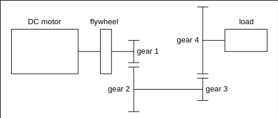
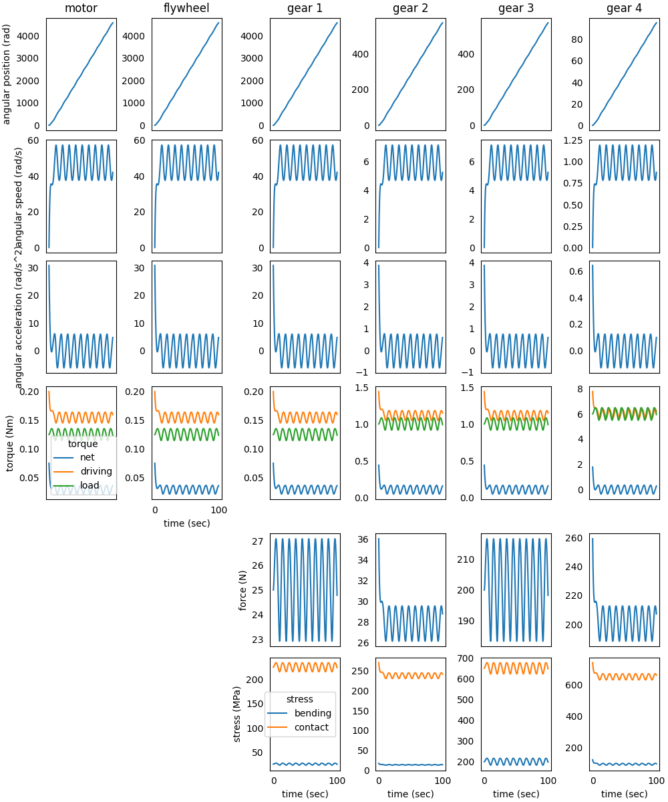
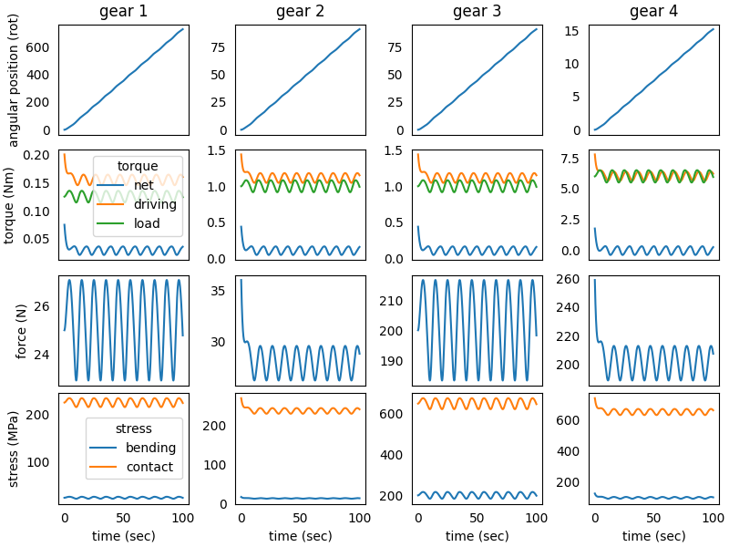
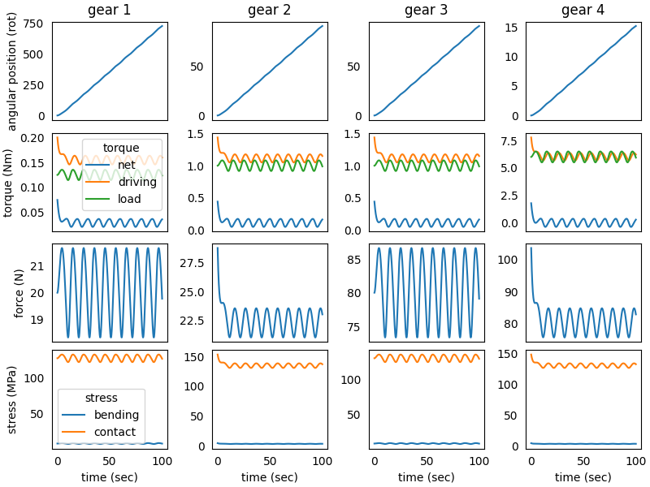

### System in Analysis

The mechanical transmission to be studied is reported in the image below:



A *flywheel* and the *gear 1* are connected to the *DC motor* output 
shaft and rotate with it. The *gear 2* mates with *gear 1* and is 
connected to *gear 3* through a rigid shaft, so *gear 2* and *gear 3* 
rotate together. The *gear 3* mates with *gear 4*, to which is connected
to the external load.  
The first step is the analysis of transmission elements kinematics and 
torques, then the focus is set to structural strength of the gear teeth.  
The teeth of all gears must be verified for static bending and contact 
stress with a safety factor 1.5. 


### Model Set Up

As a first step, we instantiate the components of the mechanical 
transmission:

```python
from gearpy.mechanical_object import DCMotor, SpurGear, Flywheel
from gearpy.units import AngularSpeed, InertiaMoment, Length, Torque, Stress

motor = DCMotor(name = 'motor',
                no_load_speed = AngularSpeed(2000, 'rpm'),
                maximum_torque = Torque(200, 'mNm'),
                inertia_moment = InertiaMoment(5, 'gm^2'))
flywheel = Flywheel(name = 'flywheel',
                    inertia_moment = InertiaMoment(30, 'gm^2'))
gear_1 = SpurGear(name = 'gear 1',
                  n_teeth = 10,
                  inertia_moment = InertiaMoment(10, 'gm^2'),
                  module = Length(1, 'mm'),
                  face_width = Length(5, 'mm'),
                  elastic_modulus = Stress(210, 'GPa'))
gear_2 = SpurGear(name = 'gear 2',
                  n_teeth = 80,
                  inertia_moment = InertiaMoment(80, 'gm^2'),
                  module = Length(1, 'mm'),
                  face_width = Length(5, 'mm'),
                  elastic_modulus = Stress(210, 'GPa'))
gear_3 = SpurGear(name = 'gear 3',
                  n_teeth = 10,
                  inertia_moment = InertiaMoment(10, 'gm^2'),
                  module = Length(1, 'mm'),
                  face_width = Length(5, 'mm'),
                  elastic_modulus = Stress(210, 'GPa'))
gear_4 = SpurGear(name = 'gear 4',
                  n_teeth = 60,
                  inertia_moment = InertiaMoment(60, 'gm^2'),
                  module = Length(1, 'mm'),
                  face_width = Length(5, 'mm'),
                  elastic_modulus = Stress(210, 'GPa'))
```

All gears are assumed to be equal, with 1 mm module, 5 mm face width, 
made in steel. The steel yield stress is 250 MPa.  
Then it is necessary to specify the types of connection between the 
components. We choose to study a non-ideal transmission so, in order to 
take into account power loss in matings due to friction, we specify a 
gear mating efficiency below `$100\%$`:

```python
from gearpy.utils import add_gear_mating, add_fixed_joint

add_fixed_joint(master = motor, slave = flywheel)
add_fixed_joint(master = flywheel, slave = gear_1)
add_gear_mating(master = gear_1, slave = gear_2, efficiency = 0.9)
add_fixed_joint(master = gear_2, slave = gear_3)
add_gear_mating(master = gear_3, slave = gear_4, efficiency = 0.9)
```

We have to define the external load applied to *gear 4*. The torque 
taken into account has 6 Nm constant component and a variable component 
dependent on the angular position of the last gear:

```python
def ext_torque(time, angular_position, angular_speed):
    return Torque(value = 6 + 0.5*np.sin(2*np.pi/10*angular_position.to('rad').value),
                  unit = 'Nm')

gear_4.external_torque = ext_torque
 ```

Finally, it is necessary to combine all components in a transmission 
object:

```python
from gearpy.transmission import Transmission

transmission = Transmission(motor = motor)
```

### Simulation Set Up

Before performing the simulation, it is necessary to specify the initial
condition of the system in terms of angular position and speed of the 
last gear in the mechanical transmission. In this case we can consider 
the *gear 4* stop in the reference position:

```python
from gearpy.units import AngularPosition

gear_4.angular_position = AngularPosition(0, 'rad')
gear_4.angular_speed = AngularSpeed(0, 'rad/s')
```

Finally, we have to set up the simulation parameters: the time 
discretization for the time integration and the simulation time. Now we 
are ready to run the simulation::

```python
from gearpy.units import TimeInterval
from gearpy.solver import Solver

solver = Solver(time_discretization = TimeInterval(0.1, 'sec'),
                simulation_time = TimeInterval(100, 'sec'),
                transmission = transmission)
solver.run()
```

### Results Analysis

We can get a snapshot of the system at a particular time of interest:

```python
from gearpy.units import Time

transmission.snapshot(target_time = Time(50, 'sec'))
```

```text
Mechanical Transmission Status at Time = 50 sec
         angular position (rad) angular speed (rad/s) angular acceleration (rad/s^2) torque (Nm) driving torque (Nm) load torque (Nm) tangential force (N) bending stress (MPa) contact stress (MPa)
motor               2221.559697             48.412745                       5.886017    0.036284            0.153769         0.117485                  NaN                  NaN                  NaN
flywheel            2221.559697             48.412745                       5.886017    0.036284            0.153769         0.117485                  NaN                  NaN                  NaN
gear 1              2221.559697             48.412745                       5.886017    0.036284            0.153769         0.117485            23.497094            23.380193           218.540109
gear 2               277.694962              6.051593                       0.735752    0.167255            1.107138         0.939884            27.678462            12.696542           237.189281
gear 3               277.694962              6.051593                       0.735752    0.167255            1.107138         0.939884            187.97675           187.041543           629.467458
gear 4                46.384583               1.02089                       0.122915    0.339245            5.978548         5.639303           199.284927            94.672174           648.124502
```

We can get a more general view of the system by plotting the time 
variables of each element with respect to time:

```python
transmission.plot(figsize = (10, 12))
```



After few seconds from the simulation start, the driving torque 
applied on *gear 4* is almost equal to the load torque on it. After 
about 10 seconds the transient is finished and the system is in a 
stationary regime, where the periodicity of the external load is clearly
visible.  
The kinematics of the transmission is clear, but gears stresses deserve
more attention, so we can generate a plot focused on structural time 
variables of the gears:

```python
transmission.plot(elements = ['gear 1', 'gear 2', 'gear 3', 'gear 4'],
                  variables = ['angular position', 'torque', 'driving torque', 'load torque',
                               'tangential force', 'bending stress', 'contact stress'],
                  angular_position_unit = 'rot',
                  figsize = (8, 6))
```



The computed stresses on gears teeth are to high, in particular the 
contact stress, even higher than the steel yield stress, so we have to 
improve the strength of the teeth by increasing the module and face 
width. As a consequence of the increased module and face width, the gear 
size will be higher, so the inertia moment increases too.  


### Improved Model Set Up

The transmission elements are updated as follows:

```python
motor = DCMotor(name = 'motor',
                no_load_speed = AngularSpeed(2000, 'rpm'),
                maximum_torque = Torque(200, 'mNm'),
                inertia_moment = InertiaMoment(5, 'gm^2'))
flywheel = Flywheel(name = 'flywheel',
                    inertia_moment = InertiaMoment(30, 'gm^2'))
gear_1 = SpurGear(name = 'gear 1',
                  n_teeth = 10,
                  inertia_moment = InertiaMoment(10, 'gm^2'),
                  module = Length(1.25, 'mm'),
                  face_width = Length(10, 'mm'),
                  elastic_modulus = Stress(210, 'GPa'))
gear_2 = SpurGear(name = 'gear 2',
                  n_teeth = 80,
                  inertia_moment = InertiaMoment(80, 'gm^2'),
                  module = Length(1.25, 'mm'),
                  face_width = Length(10, 'mm'),
                  elastic_modulus = Stress(210, 'GPa'))
gear_3 = SpurGear(name = 'gear 3',
                  n_teeth = 10,
                  inertia_moment = InertiaMoment(40, 'gm^2'),
                  module = Length(2.5, 'mm'),
                  face_width = Length(20, 'mm'),
                  elastic_modulus = Stress(210, 'GPa'))
gear_4 = SpurGear(name = 'gear 4',
                  n_teeth = 60,
                  inertia_moment = InertiaMoment(240, 'gm^2'),
                  module = Length(2.5, 'mm'),
                  face_width = Length(20, 'mm'),
                  elastic_modulus = Stress(210, 'GPa'))
```

Note that *gear 1* and *gear 2* must have the same value of module to 
make the mating possible, as well as *gear 3* and *gear 4*.  
The other parameters of the simulation remain the same as before. 


### Improved Model Result Analysis

We can get a snapshot at the same time of interest as before:

```python
transmission.snapshot(target_time = Time(50, 'sec'))
```

```text
Mechanical Transmission Status at Time = 50 sec
         angular position (rad) angular speed (rad/s) angular acceleration (rad/s^2) torque (Nm) driving torque (Nm) load torque (Nm) tangential force (N) bending stress (MPa) contact stress (MPa)
motor               2217.156919             47.314348                         5.4848    0.036905            0.154818         0.117913                  NaN                  NaN                  NaN
flywheel            2217.156919             47.314348                         5.4848    0.036905            0.154818         0.117913                  NaN                  NaN                  NaN
gear 1              2217.156919             47.314348                         5.4848    0.036905            0.154818         0.117913            18.866154             7.508917           123.849929
gear 2               277.144615              5.914293                         0.6856    0.171383            1.114691         0.943308             22.29381             4.090607           134.631358
gear 3               277.144615              5.914293                         0.6856    0.171383            1.114691         0.943308            75.464616             7.508917           126.122595
gear 4                46.290493              0.997237                       0.115219    0.359483            6.019329         5.659846            80.257717             3.812718           130.066249
```

We can also get the same plot as before, in order to make a complete 
comparison:

```python
transmission.plot(elements = ['gear 1', 'gear 2', 'gear 3', 'gear 4'],
                  variables = ['angular position', 'torque', 'driving torque', 'load torque',
                               'tangential force', 'bending stress', 'contact stress'],
                  angular_position_unit = 'rot',
                  figsize = (8, 6))
```



As desired, all stresses are decreased, the maximum contact stress is 
about 153 MPa on the *gear 2* resulting in a safety factor about 1.63, 
higher than the target 1.5. The bending stresses are even lower on all
gears.   
We can consider these gears correctly designed for the considered 
application.
